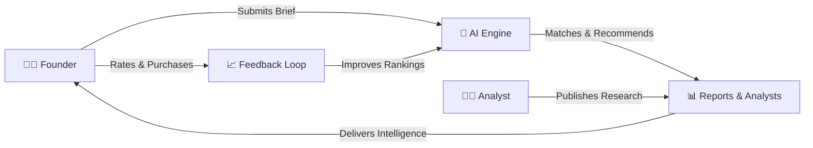
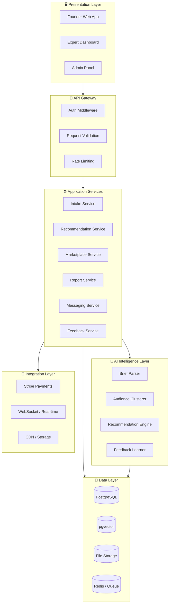
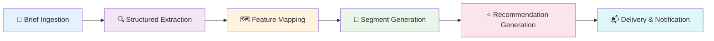
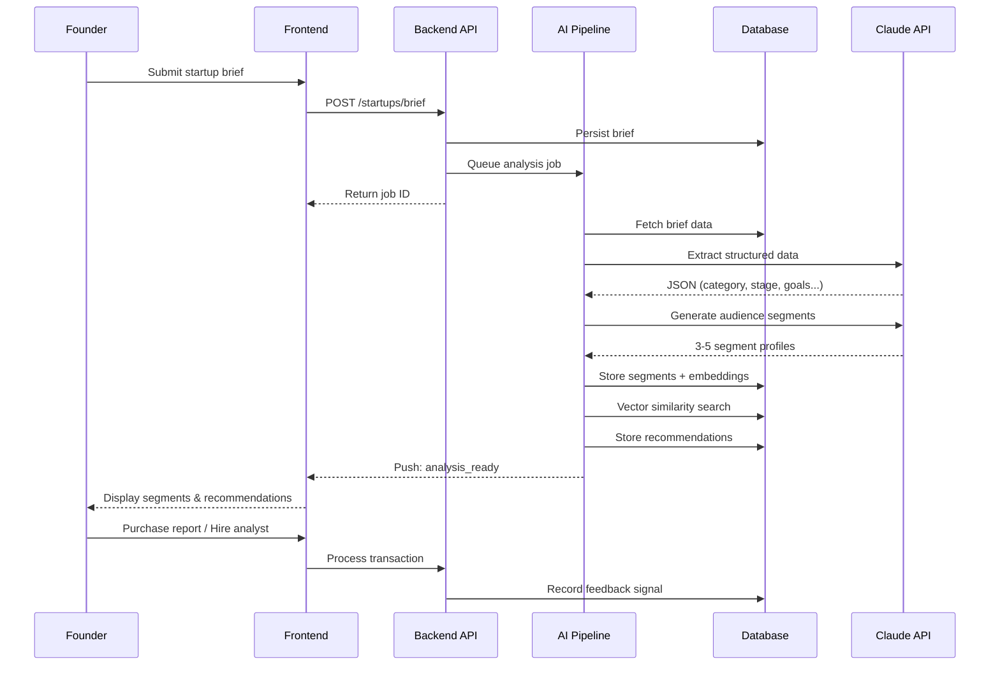
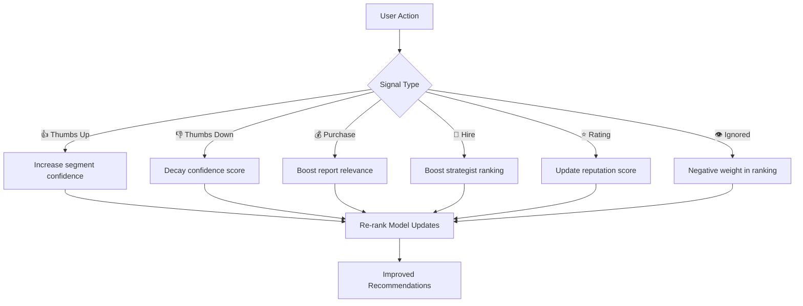
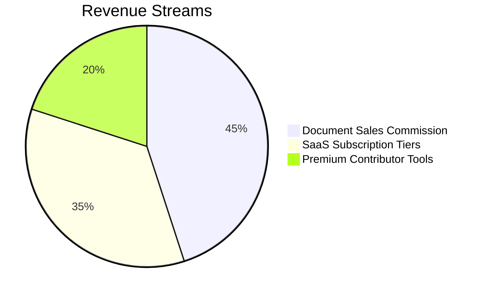
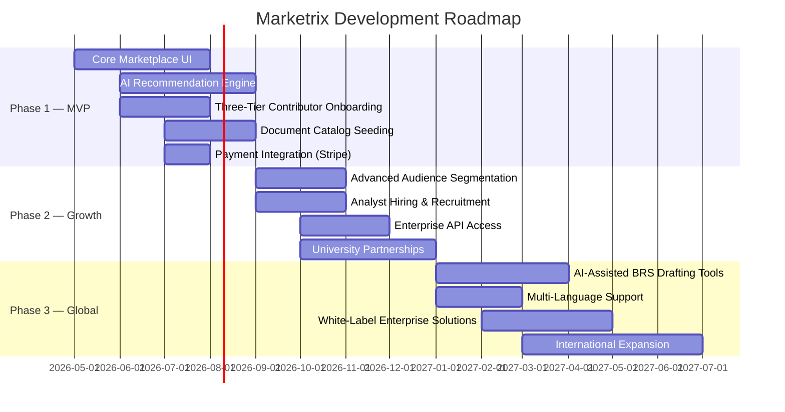

<p align="center">
  <h1 align="center">🧠 Marketrix</h1>
  <p align="center"><strong>BRS Intelligence Marketplace</strong></p>
  <p align="center">
    AI-powered marketplace where founders get instantly matched to affordable, expert-level market research — and where analysts, graduates, and student researchers build a profile, earn per unlock, and take on gig work from a global client base.
  </p>
</p>

<p align="center">
  
  
  
  
  
  
</p>

---

## 📋 Table of Contents

- [Problem Statement](#-problem-statement)
- [Solution](#-solution)
- [System Architecture](#-system-architecture)
- [AI Pipeline](#-ai-pipeline)
- [Tech Stack](#-tech-stack)
- [Project Structure](#-project-structure)
- [Data Flow](#-data-flow)
- [Business Model](#-business-model)
- [Getting Started](#-getting-started)
- [API Endpoints](#-api-endpoints)
- [Roadmap](#-roadmap)
- [Team](#-team)

---

## 🔴 Problem Statement

Professional market intelligence is broken for the people who need it most:

| Pain Point | Impact |
|-----------|--------|
| Market research reports cost **$5,000 – $50,000** | Inaccessible for early-stage startups |
| BRS documents cost **$10,000 – $30,000** | Founders skip research entirely |
| Timeline: **weeks to months** | Doesn't match startup velocity |
| Analyst work goes **unmonetized** | Thousands of quality reports sit in folders |

> Two groups who could directly solve each other's problems remain completely disconnected. That's a structural failure inside an **$80 billion global industry**.

---

## 💡 Solution

Marketrix solves both sides through one connected platform with AI at the center:



### Three-Tier Contributor Model

| Tier | Contributors | Content |
|------|-------------|---------|
| **Tier 1** — Premium | Senior analysts & consultants | Institutional-grade BRS documents |
| **Tier 2** — Emerging | MBA graduates & junior strategists | Foundational research + portfolio building |
| **Tier 3** — Passion | University students & researchers | Niche market analysis from academic work |

### For Buyers (Founders)

- Submit a brief → receive AI-matched intelligence in **under 10 minutes**
- **90%+ cost reduction** vs. traditional consulting
- Personalized explanations of *why* each document is relevant
- Browse analyst profiles and hire directly for custom work

---

## 🏗 System Architecture

Marketrix follows a **layered, API-first, cloud-native architecture** composed of six distinct layers:



### Architecture Layer Details

| Layer | Responsibility | Technology |
|-------|---------------|-----------|
| **Presentation** | All UI surfaces — web app, dashboards, admin | Next.js 16 (App Router) + Tailwind CSS 4 |
| **API Gateway** | Request routing, auth, rate limiting | Spring Boot 4 REST Controllers |
| **Application Services** | Business logic, orchestration, job management | Spring Boot Services + Message Queue |
| **AI Intelligence** | LLM pipeline — parse, segment, recommend | Claude API + OpenAI Embeddings |
| **Data Layer** | Persistent storage — relational + vector + files | PostgreSQL + pgvector + Object Storage |
| **Integration Layer** | External service connections | Stripe + WebSocket + CDN |

---

## 🤖 AI Pipeline

The core differentiator — a **6-stage asynchronous pipeline** that transforms an unstructured startup brief into structured audience intelligence:



### Pipeline Stage Details

| Stage | Trigger | Process | Output |
|-------|---------|---------|--------|
| **1. Brief Ingestion** | Founder submits brief | Validate → Persist → Queue job | Job ID for polling |
| **2. Structured Extraction** | Queue consumer picks job | LLM extracts: category, stage, geo, budget, goals, competitors | Structured JSON object |
| **3. Feature Mapping** | Extraction complete | Rule-based: category→taxonomy, geo→cluster, budget→tier | Mapped metadata |
| **4. Segment Generation** | Mapping complete | LLM generates 3-5 audience segments with psychographics | Segment profiles + embeddings |
| **5. Recommendation Generation** | Segments saved | Vector similarity + tag overlap + reputation re-ranking | Ranked recommendations |
| **6. Delivery** | Recommendations saved | Push notification via WebSocket | Dashboard populated |

### AI Model Selection

| Component | Model | Purpose |
|-----------|-------|---------|
| Brief Parser | Claude (claude-sonnet-4-20250514) | Schema-constrained JSON extraction |
| Segment Generator | Claude (claude-sonnet-4-20250514) | Psychographic profile generation |
| Positioning Analyst | Claude (claude-sonnet-4-20250514) | Competitive gap analysis |
| Embedding Generator | OpenAI text-embedding-3-small | 1536-dim vector generation |
| Similarity Search | pgvector (cosine) | Top-K nearest neighbor retrieval |

### Recommendation Scoring Formula

```
final_score = (0.5 × cosine_similarity) + (0.3 × tag_overlap) + (0.2 × reputation)
```

---

## 🛠 Tech Stack

### Frontend

| Technology | Version | Purpose |
|-----------|---------|---------|
| Next.js | 16.2.6 | React framework with App Router |
| React | 19.2.4 | UI component library |
| TypeScript | 5.x | Type-safe development |
| Tailwind CSS | 4.x | Utility-first styling |
| ESLint | 9.x | Code quality |

### Backend

| Technology | Version | Purpose |
|-----------|---------|---------|
| Spring Boot | 4.0.6 | Java application framework |
| Java | 17 | Runtime language |
| Maven | — | Build & dependency management |
| Lombok | — | Boilerplate reduction |
| Spring WebMVC | — | REST API layer |

### AI & Data (Planned)

| Technology | Purpose |
|-----------|---------|
| Claude API (Anthropic) | LLM for parsing, segmentation, analysis |
| OpenAI Embeddings | Vector generation for semantic search |
| PostgreSQL + pgvector | Relational DB + vector similarity |
| Redis / BullMQ | Async job queue for AI pipeline |
| Supabase | Auth + Storage + Realtime |

### Infrastructure (Planned)

| Technology | Purpose |
|-----------|---------|
| Vercel | Frontend hosting + Edge CDN |
| Railway / AWS | Backend deployment |
| Stripe | Payment processing |
| Socket.io | Real-time messaging |

---

## 📁 Project Structure

```
Marketrix/
├── frontend/                   # Next.js 16 Application
│   ├── app/
│   │   ├── layout.tsx         # Root layout with Geist fonts
│   │   ├── page.tsx           # Home page
│   │   ├── globals.css        # Global styles + Tailwind
│   │   └── favicon.ico
│   ├── public/                # Static assets
│   ├── package.json           # Dependencies & scripts
│   ├── tsconfig.json          # TypeScript configuration
│   ├── next.config.ts         # Next.js configuration
│   ├── postcss.config.mjs     # PostCSS + Tailwind
│   └── eslint.config.mjs      # ESLint configuration
│
├── backend/                    # Spring Boot 4 Application
│   ├── src/
│   │   ├── main/
│   │   │   ├── java/com/example/backend/
│   │   │   │   └── BackendApplication.java
│   │   │   └── resources/
│   │   │       ├── application.properties
│   │   │       ├── static/
│   │   │       └── templates/
│   │   └── test/
│   ├── pom.xml                # Maven dependencies
│   ├── mvnw                   # Maven wrapper (Unix)
│   └── mvnw.cmd               # Maven wrapper (Windows)
│
└── README.md                   # This file
```

---

## 🔄 Data Flow

### Founder Journey (Happy Path)



### Feedback Learning Loop



---

## 💰 Business Model



| Stream | Description | Target |
|--------|-------------|--------|
| **Document Sales Commission** | Platform fee on every transaction | Founders purchasing reports |
| **SaaS Subscriptions** | API access, bulk queries, analytics dashboards | Enterprise teams & VCs |
| **Premium Contributor Tools** | Enhanced visibility, career profile upgrades | Analysts & researchers |

### Key Metrics

| Metric | Target |
|--------|--------|
| Time-to-insight | < 10 minutes (vs. weeks) |
| Cost reduction | > 90% vs. traditional consulting |
| Report price range | $50 – $500 (vs. $5K – $50K) |

---

## 🚀 Getting Started

### Prerequisites

- **Node.js** ≥ 18.x
- **Java** 17
- **Maven** 3.9+ (or use included wrapper)

### Frontend Setup

```bash
cd frontend
npm install
npm run dev
```

The frontend will be available at `http://localhost:3000`

### Backend Setup

```bash
cd backend
./mvnw spring-boot:run
```

The backend will be available at `http://localhost:8080`

### Environment Variables (Planned)

```env
# Frontend (.env.local)
NEXT_PUBLIC_API_URL=http://localhost:8080
NEXT_PUBLIC_SUPABASE_URL=your_supabase_url
NEXT_PUBLIC_SUPABASE_ANON_KEY=your_anon_key

# Backend (application.properties)
spring.datasource.url=jdbc:postgresql://localhost:5432/marketrix
spring.datasource.username=postgres
spring.datasource.password=your_password
anthropic.api.key=your_claude_api_key
openai.api.key=your_openai_api_key
stripe.secret.key=your_stripe_key
```

---

## 📡 API Endpoints (Planned)

### Authentication
| Method | Endpoint | Description |
|--------|----------|-------------|
| POST | `/api/auth/register` | User registration |
| POST | `/api/auth/login` | JWT token issuance |
| POST | `/api/auth/refresh` | Token refresh |

### Startup Briefs
| Method | Endpoint | Description |
|--------|----------|-------------|
| POST | `/api/startups/brief` | Submit startup brief |
| GET | `/api/startups/:id` | Get brief details |
| GET | `/api/recommendations/:id` | Get AI recommendations |

### Marketplace
| Method | Endpoint | Description |
|--------|----------|-------------|
| GET | `/api/reports` | Browse report catalog |
| GET | `/api/reports/:id` | Report details |
| POST | `/api/reports/:id/purchase` | Purchase report |
| GET | `/api/services` | Expert service listings |
| GET | `/api/gigs` | Available gig postings |

### Feedback
| Method | Endpoint | Description |
|--------|----------|-------------|
| POST | `/api/feedback` | Submit feedback signal |
| PATCH | `/api/segments/:id/rate` | Rate a segment |

---

## 🗺 Roadmap



### Phase Breakdown

| Phase | Timeline | Key Deliverables |
|-------|----------|-----------------|
| **Phase 1 — MVP** | 6 months | Core marketplace, AI engine, contributor onboarding, catalog seeding |
| **Phase 2 — Growth** | 6 months | Advanced segmentation, analyst hiring, enterprise API, partnerships |
| **Phase 3 — Global** | 6+ months | AI drafting tools, multi-language, white-label, international expansion |

---

## 🌍 Market Opportunity

| Segment | Opportunity |
|---------|------------|
| Global MarTech industry | $500B+ |
| Market research industry | $80B+ |
| Target: early-stage startups with $0 research budget | 95% of founders |
| Geographic focus | South Asia, Southeast Asia, Africa, Middle East |

---

## 🛡 Ethical AI & Compliance

- **Privacy**: GDPR and PDPA aligned; encrypted data at rest and in transit
- **Bias Mitigation**: Diversity scoring prevents over-concentration in dominant segments
- **Transparency**: Every AI recommendation includes explainability summary
- **Human Oversight**: Moderation checkpoints in document approval pipeline
- **Role-Based Access**: Strict data siloing between contributors, buyers, and platform analytics

---

## 🏆 Hackathon Context

Built for **The Infinity AI BuildFest 2026** — MarTech Track (Audience Intelligence AI Challenge)

| Criterion | Our Approach |
|-----------|-------------|
| **Innovation** | First-principle rethinking of audience intelligence for pre-revenue startups |
| **Technical Execution** | 6-stage async AI pipeline with schema-validated LLM outputs |
| **Business Model** | Dual-sided marketplace with three revenue streams |
| **Real-World Impact** | 90%+ cost reduction, <10 min time-to-insight |
| **Scalability** | Cloud-native, API-first, modular service boundaries |

---

## 👥 Team

**BRS Intelligence Marketplace** — Democratizing market intelligence for every entrepreneur, regardless of geography, funding stage, or professional network.

---

<p align="center">
  <em>The knowledge that was always there, just invisible, finally finds the people who need it.</em>
</p>
